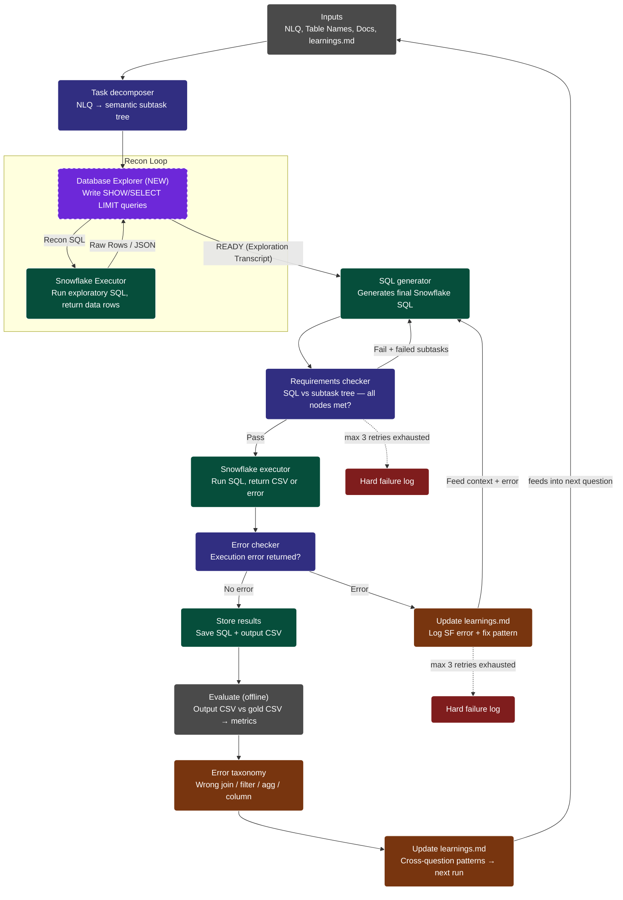

```mermaid
flowchart TD
    %% Define Styles
    classDef inputs fill:#4A4A4A,color:#fff,stroke:#fff,stroke-width:1px,rx:5px,ry:5px
    classDef llm_call fill:#312e81,color:#fff,stroke:#fff,stroke-width:1px,rx:5px,ry:5px
    classDef new_llm fill:#6d28d9,color:#fff,stroke:#fff,stroke-width:2px,rx:5px,ry:5px,stroke-dasharray: 5 5
    classDef execution fill:#064e3b,color:#fff,stroke:#fff,stroke-width:1px,rx:5px,ry:5px
    classDef memory fill:#78350f,color:#fff,stroke:#fff,stroke-width:1px,rx:5px,ry:5px
    classDef failure fill:#7f1d1d,color:#fff,stroke:#fff,stroke-width:1px,rx:5px,ry:5px

    %% Nodes
    Inputs["Inputs<br/>NLQ, Table Names, Docs, learnings.md"]:::inputs
    
    Decomposer["Task decomposer<br/>NLQ → semantic subtask tree"]:::llm_call
    
    subgraph Recon Loop
        Explorer["Database Explorer (NEW)<br/>Write SHOW/SELECT LIMIT queries"]:::new_llm
        Exploration_Exec["Snowflake Executor<br/>Run exploratory SQL, return data rows"]:::execution
    end
    
    Generator["SQL generator<br/>Generates final Snowflake SQL"]:::execution
    style Generator fill:#064e3b,color:#fff
    
    ReqChecker["Requirements checker<br/>SQL vs subtask tree — all nodes met?"]:::llm_call
    
    Executor["Snowflake executor<br/>Run SQL, return CSV or error"]:::execution
    
    ErrorChecker["Error checker<br/>Execution error returned?"]:::llm_call
    
    Store["Store results<br/>Save SQL + output CSV"]:::execution
    
    Eval["Evaluate (offline)<br/>Output CSV vs gold CSV → metrics"]:::inputs
    
    Taxonomy["Error taxonomy<br/>Wrong join / filter / agg / column"]:::memory
    
    UpdateMemoryFinal["Update learnings.md<br/>Cross-question patterns → next run"]:::memory
    
    UpdateMemoryError["Update learnings.md<br/>Log SF error + fix pattern"]:::memory
    
    HardFailReq["Hard failure log"]:::failure
    HardFailExec["Hard failure log"]:::failure

    %% Connections
    Inputs --> Decomposer
    Decomposer --> Explorer
    
    %% Exploration Loop
    Explorer -->|Recon SQL| Exploration_Exec
    Exploration_Exec -->|Raw Rows / JSON| Explorer
    Explorer -->|"READY (Exploration Transcript)"| Generator
    
    %% Generation and Requirements Loop
    Generator --> ReqChecker
    ReqChecker -- "Fail + failed subtasks" --> Generator
    ReqChecker -. "max 3 retries exhausted" .-> HardFailReq
    
    %% Execution and Error Loop
    ReqChecker -- Pass --> Executor
    Executor --> ErrorChecker
    
    ErrorChecker -- Error --> UpdateMemoryError
    UpdateMemoryError -->|Feed context + error| Generator
    UpdateMemoryError -. "max 3 retries exhausted" .-> HardFailExec
    
    ErrorChecker -- No error --> Store
    Store --> Eval
    Eval --> Taxonomy
    Taxonomy --> UpdateMemoryFinal
    
    UpdateMemoryFinal -->|"feeds into next question"| Inputs
```
